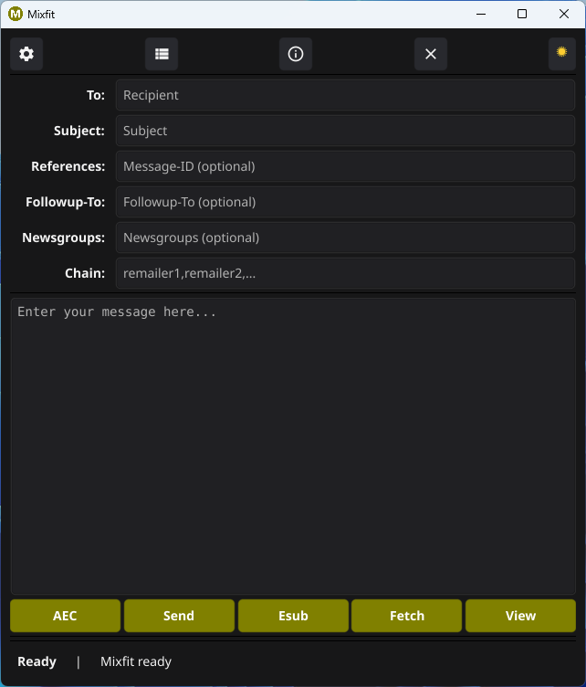

# Mixfit YAMN Client   

An easy to use [YAMN](https://github.com/crooks/yamn) Mixnet client for anonymous email or Usenet messages.        

It supports [AEC](https://github.com/Ch1ffr3punk/AEC) and with it's proxy settings   
the usage of the Nym Mixnet or Tor Network.   

For more information about YAMN visit SEC3's [site](https://www.sec3.net/misc/).     



About the AEC, Esub, Fetch and View button:  

If you use AEC you can attach the QR-Code in your message,   
to be decoded on your air gapped device. The Esub button   
is used to generate Subject: strings for the Usenet Group   
alt.anonymous.messages, which you can retrieve with the Fetch   
button and then use the View button to Display the AEC QR-Code.    

If you like Mixfit consider a small donation      
in crypto currencies or buy me a coffee.     
```
BTC: bc1qm0e7r94ht60tu7zuewf0ftl3td0xc700rvcagn
Nym: n1f0r6zzu5hgh4rprk2v2gqcyr0f5fr84zv69d3x          
```
<a href="https://www.buymeacoffee.com/Ch1ffr3punk" target="_blank"></a>

Mixfit is dedicated to Alice and Bob.